# Mapa interno — delivery

Delivery planifica el reparto: arma rutas de camión con los pedidos que llegan
espejados desde **PEDIDO**, calcula cuánto pesa cada uno y en qué orden se
visita, y cierra la ruta marcando qué se entregó, qué volvió y por qué. No
cotiza nada al cliente ni da de alta pedidos: eso ocurre en PEDIDO y en la APK
de Entrega, y aquí sólo se refleja.

## Diagrama

```mermaid
flowchart TD
    PEDIDO["PEDIDO (app externa)\nintegration/orders, integration/clients"]
    AUTH["auth.procovar.cloud\n(SSO + Accesos firmado)"]
    VENTRA["Data Warehouse Ventra\n(VPN, read-only)"]
    OSM["Nominatim / tiles OSM"]

    SYNC["sync-queue.mjs\n(worker, cron 1 min)"]
    PRISMA["src/lib/prisma.ts"]
    DB[("Postgres\nOrder / Customer / Product / Branch / Vehicle / Route")]

    PEDIDO -- "GET integration/orders\nGET integration/clients" --> SYNC
    SYNC -- "POST /api/quote/batch\nPOST /api/products/sync" --> API_QUOTEBATCH["api/quote/batch"]
    SYNC --> PRISMA
    API_QUOTEBATCH --> HOMEQ["src/lib/homeDeliveryQuote.ts\n(peso, no precio)"]

    subgraph NEXT["Next.js 15 — monolito"]
        API_ORDERS["api/orders\n(GET/PATCH, sin POST)"]
        API_AVAILABLE["api/orders/available\n(facturaEstado='igual')"]
        API_ROUTES["api/routes, api/routes/[id]"]
        API_QUOTEHD["api/quote/home-delivery\n(x-api-key, sólo lectura)"]
        API_RECOMPUTE["api/orders/recompute-weights\napi/admin/recompute"]
        API_SETTINGS["api/settings\n(currency, tiposVehiculo)"]
        API_ENTRAR["api/auth/entrar\napi/auth/callback"]

        PRICING["src/lib/pricing.ts\nhaversine + greedy nearest-neighbor"]
        DOMENT["src/lib/domicilioEntrega.ts\n(fórmula de Entrega, solo lectura)"]
        TASA["src/lib/tasaCambio.ts"]
        ALMACENES["src/lib/almacenes.ts"]
        WAREHOUSE["src/lib/warehouse.ts"]
        SCOPE["src/lib/scope.ts\n(branchId, multi-sucursal)"]
        PROCAUTH["src/lib/procovar-auth.ts\n(HMAC firmado)"]

        PAGEORDERS["(dashboard)/orders/page.tsx"]
        PAGEROUTES["(dashboard)/routes/page.tsx"]
        MAPC["components/MapComponent.tsx\n(Leaflet)"]
        CIERRE["components/CierreDeRuta.tsx"]
        RUTACOMP["src/lib/rutaCompartir.ts"]
        EVENTOS["api/eventos (SSE)"]
        REDIS["src/lib/redis.ts"]
    end

    GMAPS["Google Maps\n(enlace de navegación)"]

    PRISMA <--> DB
    API_ORDERS --> PRISMA
    API_AVAILABLE --> PRISMA
    API_ROUTES --> PRISMA
    API_ROUTES --> PRICING
    API_QUOTEHD --> DOMENT
    API_QUOTEHD --> TASA
    API_QUOTEHD --> ALMACENES
    TASA -- "pedirFirmado" --> PROCAUTH
    ALMACENES -- "pedirFirmado" --> PROCAUTH
    PROCAUTH -- "HMAC-SHA256" --> AUTH
    API_RECOMPUTE --> WAREHOUSE
    WAREHOUSE -- "Bearer token, VPN" --> VENTRA
    API_ENTRAR --> PROCAUTH

    PAGEORDERS --> API_ORDERS
    PAGEORDERS --> API_AVAILABLE
    PAGEROUTES --> API_ROUTES
    PAGEROUTES --> MAPC
    MAPC -- "tiles" --> OSM
    PAGEROUTES --> CIERRE
    CIERRE --> API_ROUTES
    PAGEROUTES --> RUTACOMP
    RUTACOMP -- "enlace de navegación" --> GMAPS
    PAGEROUTES --> EVENTOS
    EVENTOS --> REDIS
    SYNC -- "publica cambio" --> REDIS

    PEDIDO -. "pone el costo\n(APK de Entrega)" .-> PEDIDO
```

## Piezas

| Pieza | Dónde vive | De qué se ocupa |
|---|---|---|
| `sync-queue.mjs` | raíz del repo (worker Node, fuera de Next) | Trae pedidos y clientes de PEDIDO cada minuto, y el catálogo cada 12h. Escribe en Postgres. No cobra nada. |
| `src/lib/pricing.ts` | `src/lib` | Lo único de geometría que delivery calcula de verdad: distancia Haversine y orden de visita (greedy nearest-neighbor). |
| `src/lib/domicilioEntrega.ts` + `src/lib/homeDeliveryQuote.ts` | `src/lib` | Reproducen la fórmula de Entrega (tarifa÷tasa×distancia×peso) para que PEDIDO pueda recotizar tras una factura. No escriben el precio, lo devuelven. |
| `src/lib/tasaCambio.ts` / `src/lib/almacenes.ts` | `src/lib` | Leen de Accesos (vía `procovar-auth.ts`, firmado) la tasa de cambio, la tarifa base y los almacenes de cada sucursal. |
| `src/lib/warehouse.ts` | `src/lib` | Cliente del Data Warehouse "Ventra" (NestJS, sólo lectura, por VPN) para el catálogo de pesos por producto. |
| `src/lib/procovar-auth.ts` | `src/lib` | Cliente del SSO único (`auth.procovar.cloud`): login y peticiones firmadas HMAC a Accesos. |
| `src/lib/scope.ts` | `src/lib` | Resuelve a qué sucursal se limita cada consulta (multi-sucursal); no filtra por usuario. |
| `src/lib/filtrosPedido.ts` | `src/lib` | Los filtros del catálogo de pedidos (estado, archivado, facturaEstado…), compartidos entre la lista y el armador de rutas, aplicados en la base de datos. |
| `src/lib/rutaCompartir.ts` | `src/lib` | Arma el enlace de navegación de Google Maps con las paradas en orden; el reparto real no pasa por esta app. |
| `src/app/api/*` | `src/app/api` | Endpoints REST del monolito: pedidos, rutas, vehículos, sucursales, almacenes, cotización, settings, auth. |
| `src/app/(dashboard)/*` | `src/app/(dashboard)` | Pantallas: dashboard, pedidos, rutas (con mapa), vehículos, almacenes, clientes, informes. |
| `src/components/MapComponent.tsx` | `src/components` | Mapa Leaflet sobre tiles de OpenStreetMap; dibuja paradas y el recorrido. |
| `src/components/CierreDeRuta.tsx` | `src/components` | Marca cada parada como entregada/devuelta/cancelada al volver el camión; de aquí sale el post-despacho. |
| `src/app/api/eventos` + `src/lib/redis.ts` | `src/app/api/eventos`, `src/lib` | Server-Sent Events para avisar en vivo de cambios (Redis pub/sub, opcional: cae a nada si no hay `REDIS_URL`). |
| `prisma/schema.prisma` | `prisma` | Modelo de datos: `Order`, `Customer`, `Product`, `Branch`, `Vehicle`, `Route`, `Settings`. Comentado extensamente con el porqué de cada campo. |

## Las fronteras

- **PEDIDO** (aplicación externa): habla con delivery en los dos sentidos.
  - Delivery **pide** (`sync-queue.mjs` → `GET {PEDIDO_API_URL}/integration/orders` y `/integration/clients`, con `x-api-key`): así entran pedidos y clientes, nunca a mano.
  - PEDIDO **pide** a delivery: `POST /api/quote/home-delivery` (recotizar tras factura) y recibe de vuelta `/api/quote/batch` y `/api/products/sync` desde el propio `sync-queue.mjs`. Todo autenticado con `SERVICE_API_KEY` vía header `x-api-key` (ver `src/lib/serviceAuth.ts`).
- **APK de Entrega**: delivery **no habla con ella directamente**. El costo del domicilio lo pone el repartidor desde Entrega dentro de PEDIDO (`pedidoCosto`, `facturaDomicilio`), y llega a delivery ya mezclado en el espejo de PEDIDO. La única fórmula compartida (`domicilioEntrega.ts`) existe para que, si el pedido se recotiza aquí, salga el mismo número que en la APK.
- **auth.procovar.cloud (Accesos + SSO)**: login único (`/api/auth/entrar`, `/api/auth/callback`, `src/lib/procovar-auth.ts`) y, con el mismo cliente firmado HMAC, lectura de tasa de cambio, tarifa base y almacenes por sucursal (`tasaCambio.ts`, `almacenes.ts`).
- **Data Warehouse "Ventra"** (NestJS, sólo lectura, alcanzable sólo por la VPN WireGuard): catálogo de pesos por producto (`src/lib/warehouse.ts`, token permanente `WAREHOUSE_API_TOKEN`).
- **Postgres**: única base de datos, vía Prisma (`src/lib/prisma.ts`, `prisma/schema.prisma`).
- **Redis** (opcional): cola Bull para el propio `sync-queue.mjs` y canal pub/sub para el SSE de `/api/eventos`. Sin `REDIS_URL` la app sigue funcionando, sin avisos en vivo.
- **Mapas**: Leaflet + tiles de OpenStreetMap para pintar rutas (`MapComponent.tsx`); Nominatim para geocodificar direcciones (`src/lib/geocode.ts`); un enlace de navegación a Google Maps para el recorrido real del camión (`src/lib/rutaCompartir.ts`) — el conductor no usa esta app en la calle.

## Por dónde entrar

1. **`prisma/schema.prisma`** — el modelo entero está comentado con el porqué de cada campo (incluidos los que ya no se usan). Es el sitio más rápido para entender qué es cada cosa y qué se le quitó.
2. **`sync-queue.mjs`** — el único punto de entrada de datos reales (pedidos, clientes, catálogo). Sin entenderlo, no se entiende de dónde sale nada de lo que se ve en pantalla.
3. **`src/lib/domicilioEntrega.ts`** y **`src/lib/pricing.ts`** — el primero explica qué NO calcula delivery y por qué (la fórmula es de Entrega); el segundo, lo poco que sí calcula (peso y recorrido). Los dos juntos evitan confundir un número con el otro.
4. **`src/app/api/quote/home-delivery/route.ts`** — el único endpoint donde delivery "cotiza" algo, con la razón de por qué existe escrita en el propio fichero.
5. **`README.md`** — léase con cuidado: describe una versión anterior (Next 14, motor de precios propio, alta manual, `/driver/[id]`, `/register`) que ya no está en el código. Sirve para ver qué se quitó, no para entender qué hay ahora.

## Restos

El código está limpio de fórmulas de precio: `pricing.ts` conserva sólo un
comentario explicando que había cuatro fórmulas distintas y las quitó todas el
03/09/2026, y `Settings` en el schema tiene los mismos campos de tarifa
comentados como retirados (se quedan `currency`, `cupRate` para mostrar, y
`tiposVehiculo`/`costoKmUsd` porque son costo de flota, no precio al cliente).
`orders/route.ts` y `customers/route.ts` tienen un comentario en el sitio
exacto donde antes iba el `POST` de alta manual, dejando dicho que se quitó y
por qué. El modelo `VentaFacturada` sigue en el schema pero marcado como
retirado (el cotejo con factura ahora lo hace PEDIDO). Lo único que no está
limpio es el **`README.md`**, que sigue describiendo el producto viejo
(pricing engine, alta a mano, vista de conductor `/driver/[id]`, `/register`,
Next 14): nada de eso existe ya en `src/app`.
